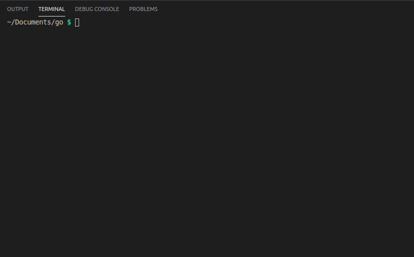

# CDI - Change directory interactively

Don't waste more time in the terminal browsing folders with CD



## Installation

#### Automatic installer

Copy paste and run in your terminal
```bash
curl -fsSL https://raw.githubusercontent.com/antonioolf/cdi/master/install.sh | bash
```

#### Manual installation
The installation process is quite simple, and can be done manually with just two steps.

- Download the main CDI script `cdi.sh` and place it in the `/usr/local/bin` directory (or any other of your choice).
- Add an alias for the script to your .bashrc file as follows:
```bash
alias cdi='. /usr/local/bin/cdi.sh'
```

- Run `source ~/.bashrc` for the change to take effect

## Usage

Just type `cdi`

## Contributing
Pull requests and issues are welcome!

## License
[MIT](https://opensource.org/licenses/MIT)
